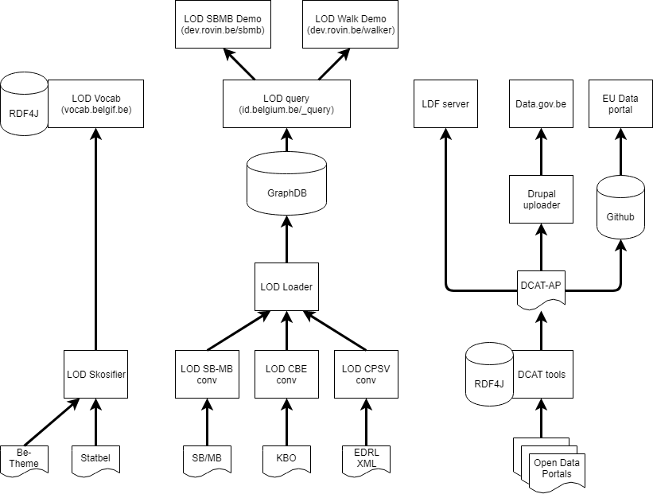

# lod-docs
Documentation for LOD PoC

## Components

### Converters

Tools for converting existing open data sources into linked open data (RDF) files.

|Component|Github|Presentation|
|---------|------|------------|
|LOD CBE|https://github.com/fedict/lod-cbe|https://gitpitch.com/fedict/lod-cbe|
|LOD CPSV|https://github.com/fedict/lod-cpsv|https://gitpitch.com/fedict/lod-cpsv|
|LOD SBMB|https://github.com/fedict/lod-sbmb|https://gitpitch.com/fedict/lod-sbmb|

### Load and query front-ends

Generic load and query front-ends for Ontotext GraphDB.

|Component|Github|Presentation|
|---------|------|------------|
|LOD Loader|https://github.com/fedict/lod-loader|https://gitpitch.com/fedict/lod-loader|
|LOD Query|https://github.com/fedict/lod-query|https://gitpitch.com/fedict/lod-query|

### Vocab.belgif.be

Vocabulary server, exposing thesauri and code lists as linked open data (SKOS) files.
A human-friendly search interface is available, as well as an [LDF lightweight API](http://linkeddatafragments.org/software/)

|Component|Github|Presentation|
|---------|------|------------|
|LOD Skosifier|https://github.com/fedict/lod-skosifier|https://gitpitch.com/fedict/lod-skosifier|
|LOD Vocab|https://github.com/fedict/lod-vocab|https://gitpitch.com/fedict/lod-vocab|

### DCAT (in production since 2016) flow

Separate flow for harvesting local, regional, federal (metadata about) open data sets to populate http://data.gov.be

|Github|Presentation|
|------|------------|
|https://github.com/fedict/dcattools|https://gitpitch.com/fedict/dcattools|

## Further reading

- Eclipse [RDF4J documentation](http://docs.rdf4j.org/)
- Free eBook [Validating RDF Data](http://book.validatingrdf.com/)
- [JSON-LD Framing](https://json-ld.org/spec/latest/json-ld-framing/)
- [Linked Data Fragments](http://linkeddatafragments.org/) client-side SPARQL 
- [Hydra-CG](http://www.hydra-cg.com/) hypermedia API
